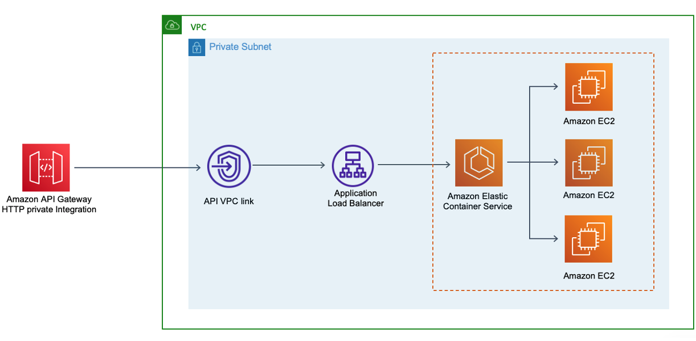

# How to create a HTTP Api with Cognito that connects to an ECS Service

HTTP Api Gateway embedded with Cognito for authentication, connected to an ECS service

## Architecture

This is a high level overview of the architecture.



## How to programmatically access ECS Service?

First setup the following variables

```console
export EMAIL=""
export PASSWORD=""
export CLIENT_ID=""
export POOL_ID=""
export API_URL=""
```

Then create a new user (You can skip this step if you already have a user)

```console
aws cognito-idp sign-up \
  --client-id ${CLIENT_ID} \
  --username ${EMAIL} \
  --password ${PASSWORD}
```

Then you can confirm the user by setting a new password (we are reusing the initial password for simplicity sake)

```console
aws cognito-idp admin-set-user-password \
  --user-pool-id ${POOL_ID} \
  --username ${EMAIL} \
  --password ${PASSWORD} \
  --permanent
  ```

Then you can retrieve the token from cognito

```console
export TOKEN=$(aws cognito-idp initiate-auth \
    --client-id ${CLIENT_ID} \
    --auth-flow USER_PASSWORD_AUTH \
    --auth-parameters USERNAME=${EMAIL},PASSWORD=${PASSWORD} \
    --query 'AuthenticationResult.AccessToken' \
    --output text)
```

Finally access the url that you have indicated with the retrieved token

```console
curl -v -H "Authorization: Bearer $TOKEN" $API_URL
```

If you are too lazy, you can always use [my script](programmatic-login.sh)
